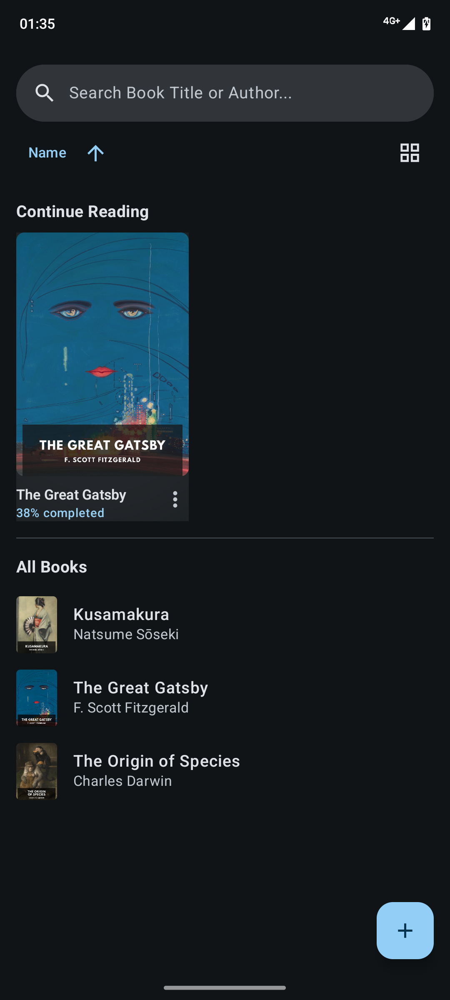
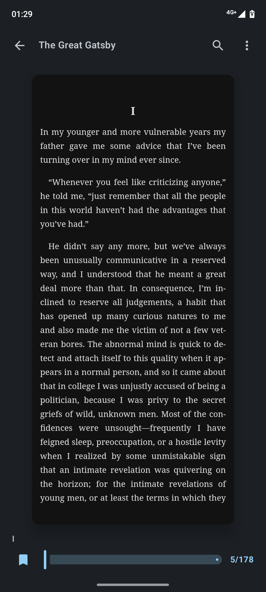
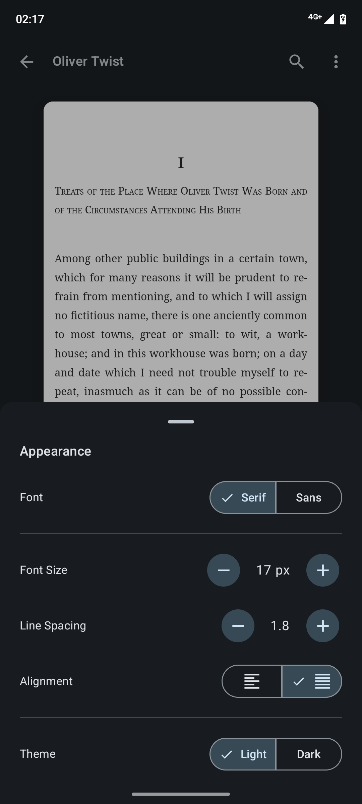
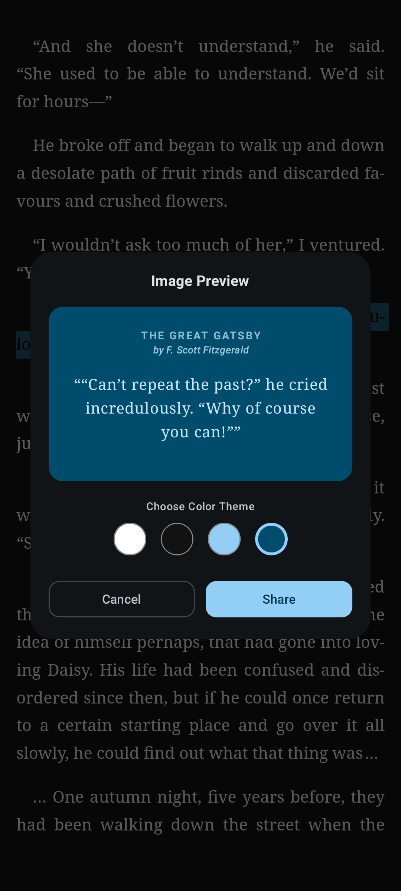

<h1 align="center">DBook</h1>

<p align="center">
  
</p>

<p align="center">Read anywhere with your essential book reader</p>

---

## Features

* **Highlights & Annotations**: Select text, save highlights with custom colors, and manage your annotations.
* **In-Book Search**: Easily search for words or phrases within the book with dynamic text highlighting.
* **Customizable Reader:** Change your font type, text sizes, line spacing, and dark mode for reader screen.
* **Share Text as Image**: Highlight your favorite quotes and share them directly as images.
* **Auto Sync Reading Progress**: Automatically saves and restores your last read location and percentage.
  
---

## Screenshots

| Home Screen | Reader Screen | Reader Customization | Share as Image |
|:-----------:|:-------------:|:-------------:|:-------------:|
|  |  |  | 

---

## Building from Source

### Prerequisites
Ensure you have the following prerequisites installed before starting:
* JDK 21 or higher
* Android SDK Version 26+ (Android 8.0 Oreo or higher)
* Git

### Steps

1. Clone the repository:
```bash
git clone https://github.com/Dhimasekaputraa/dbook.git
cd dbook
```

2. Prepare Your Android Device / Emulator
* For Physical Device: Enable Developer Options on your phone. Then, turn on USB Debugging. Connect your phone via USB and allow debugging permissions on your device screen.
* For Emulator: Create an Android Virtual Device (AVD) via Android Studio's Device Manager (Recommended: Pixel device running API 30+).

3. Build the APK
Option A: Using Android Studio (GUI)

- Open Android Studio, click Open, and select the cloned dbook directory.
- Let Gradle sync to complete.
- Select your connected device/emulator from the top toolbar dropdown.
- Click Run (Shift + F10) to build, install, and launch the app.

Option B: Using Command Line (CLI)
Ensure your emulator is running or your physical device is connected via USB debugging (adb devices), then:

- Build & Install Directly to Device
  
**Linux / macOS**
```bash
./gradlew installDebug
```
**Windows**
```powershell
gradlew.bat installDebug
```

- or Build APK Only (Without Installing)
  
**Linux / macOS**
```bash
./gradlew assembleDebug
```
**Windows**
```powershell
gradlew.bat assembleDebug
```
The compiled APK will be available at: ``app/build/outputs/apk/debug/app-debug.apk``

---

## Download
1. Go to the **Releases** section.
   You can download the pre-compiled APK directly from the **[GitHub Releases](https://github.com/Dhimasekaputraa/dbook/releases)** page.
3. Download the latest `DBook-vX.X.X-release.apk`.
4. Install it on your Android device.

---

## License
This program is free software: you can redistribute it and/or modify it under the terms of the [MIT License](LICENSE).

The following JavaScript and open-source libraries are bundled in this software:

* [ePub.js](https://github.com/futurepress/epubjs-reader/), which is licensed under the BSD-2-Clause License.
* [JSZip](https://github.com/johanpoirier/zip.js), which is licensed under the BSD-3-Clause License.


